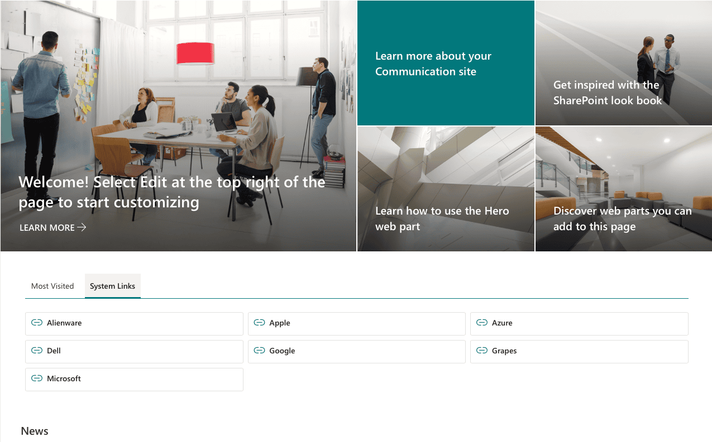
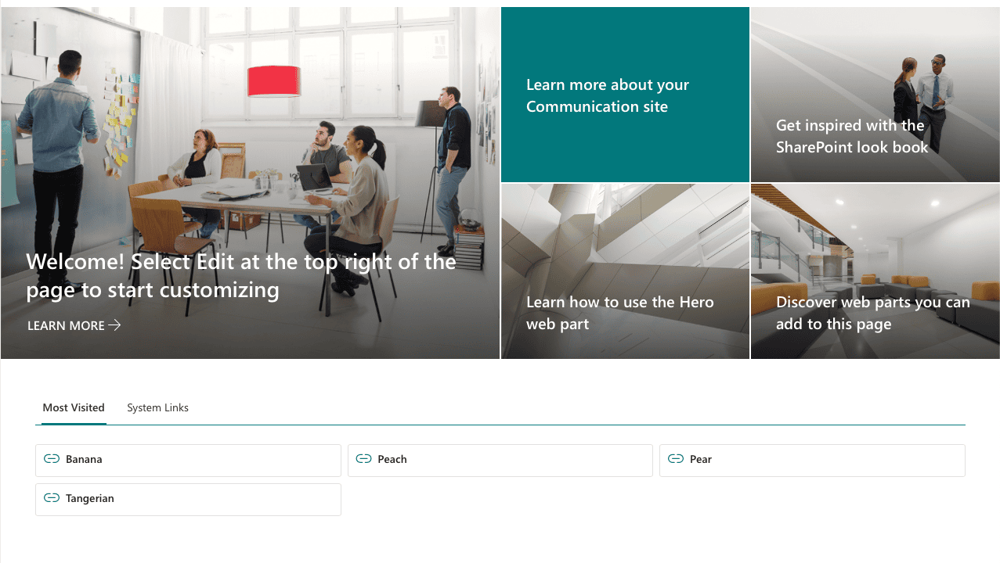
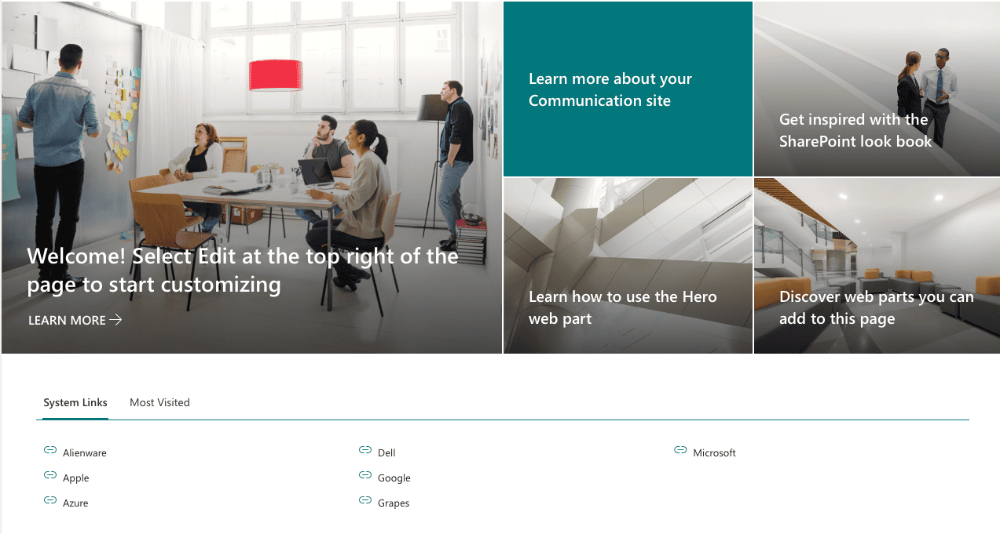
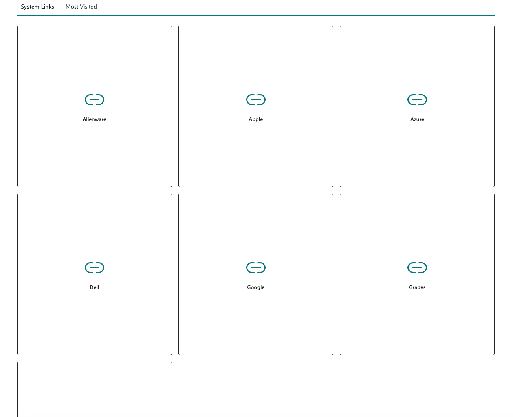
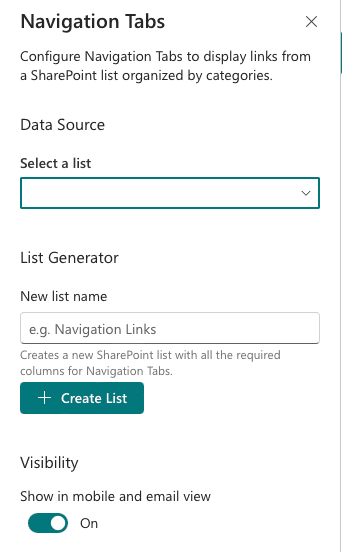
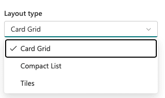

# Navigation Tabs

## Summary

A SharePoint Framework (SPFx 1.22) web part that displays navigation links organized by tabbed categories. Links are stored in a SharePoint list and rendered in one of three layout styles: Card, Compact, and Tile.

Features include:

- Tabbed Categories — Links automatically grouped into tabs by Category field
- Three Layout Options — Card, Compact, and Tile layouts
- Built-in List Generator — Create a pre-configured SharePoint list from the property pane
- Drag-and-Drop Tab Ordering — Reorder category tabs from the property pane
- Custom Icons — Each link supports a Thumbnail/Image column
- Click Tracking — Automatic click count tracking per link
- Active/Inactive Toggle — Hide links without deleting them
- Per-Link New Tab Control — Override default new tab behavior on individual links
- Configurable Grid — Adjust cards per row (2-6) for Card and Tile layouts

## Screenshots

## Compatibility

| :warning: Important |
|:---------------------------|
| Every SPFx version is optimally compatible with specific versions of Node.js. In order to be able to build this sample, you need to ensure that the version of Node on your workstation matches one of the versions listed in this section. |

## Applies to

- [SharePoint Framework](https://aka.ms/spfx)
- [Microsoft 365 tenant](https://learn.microsoft.com/sharepoint/dev/spfx/set-up-your-developer-tenant)

> Get your own free development tenant by subscribing to [Microsoft 365 developer program](http://aka.ms/o365devprogram)

## Contributors

- [W. Kevin Wolff](https://github.com/wkwolff)

## Version history

| Version | Date | Comments |
|---------|------|----------|
| 1.0 | February 20, 2026 | Initial release |

## Prerequisites

- SharePoint Online tenant with App Catalog
- Site Collection Administrator permissions (to deploy the package)

## Minimal path to awesome

- Clone this repository (or download this solution as a .ZIP file then unzip it)
- From your command line, change your current directory to the directory containing this sample (`react-navigation-tabs`, located under `samples`)
- in the command line run:
  - `npm install`
  - `npm start`

> This sample can also be opened with [VS Code Remote Development](https://code.visualstudio.com/docs/remote/remote-overview). Visit <https://aka.ms/spfx-devcontainer> for further instructions.

## List Schema

The web part reads from a SharePoint list with the following columns. You can create this list automatically using the built-in List Generator, or create it manually.

| Column | Type | Required | Description |
|--------|------|----------|-------------|
| Title | Single line of text | Yes | Display name for the link |
| LinkURL | Hyperlink | Yes | Destination URL |
| Category | Choice | Yes | Tab category (e.g., General, Resources, Tools) |
| LinkDescription | Multiple lines of text | No | Description shown in Card layout |
| LinkIcon | Image (Thumbnail) | No | Custom icon for the link |
| SortOrder | Number | No | Sort order within a category (default: 100) |
| OpenInNewTab | Yes/No | No | Override the web part's default new tab setting |
| IsActive | Yes/No | No | Set to No to hide a link without deleting it |
| ClickCount | Number | No | Auto-incremented click counter (hidden from forms) |

## Configuration

| Setting | Description | Default |
|---------|-------------|---------|
| List | SharePoint list containing navigation links | *(none)* |
| Layout Type | Card, Compact, or Tile | Card |
| Cards Per Row | Number of items per row (2-6) | 3 |
| Show Descriptions | Display link descriptions (Card layout only) | Yes |
| Open in New Tab | Default behavior for link clicks | Yes |
| Tab Order | Drag-and-drop reordering of category tabs | *(auto-detected)* |

## Features

This Web Part illustrates the following concepts on top of the SharePoint Framework:

- Using PnPjs v4 for SharePoint list data access
- React 17 with TypeScript 5.6
- Fluent UI React components
- @pnp/spfx-property-controls for list picker and drag-and-drop ordering
- Image column rendering for custom link icons
- Automatic SharePoint list provisioning from the property pane
- Click tracking via list item updates

## Help

We do not support samples, but this community is always willing to help, and we want to improve these samples. We use GitHub to [track issues](https://github.com/pnp/sp-dev-fx-webparts/issues), which makes it easy for community members to volunteer their time and help resolve issues.

If you're having issues building the solution, please run [spfx doctor](https://pnp.github.io/cli-microsoft365/cmd/spfx/spfx-doctor/) from within the solution folder to diagnose incompatibility issues with your environment.

You can try looking at [issues related to this sample](https://github.com/pnp/sp-dev-fx-webparts/issues?q=label%3A%22sample%3A+react-navigation-tabs%22) to see if anybody else is having the same issues.

You can also try looking at [discussions related to this sample](https://github.com/pnp/sp-dev-fx-webparts/discussions?discussions_q=react-navigation-tabs) and see what the community is saying.

If you encounter any issues using this sample, [create a new issue](https://github.com/pnp/sp-dev-fx-webparts/issues/new?assignees=&labels=Needs+Triage%2Ctype%3Abug-suspected&template=bug-report.yml&sample=react-navigation-tabs&authors=@wkwolff&title=react-navigation-tabs+-+).

For questions regarding this sample, [create a new question](https://github.com/pnp/sp-dev-fx-webparts/issues/new?assignees=&labels=Needs+Triage%2Ctype%3Aquestion&template=question.yml&sample=react-navigation-tabs&authors=@wkwolff&title=react-navigation-tabs+-+).

Finally, if you have an idea for improvement, [make a suggestion](https://github.com/pnp/sp-dev-fx-webparts/issues/new?assignees=&labels=Needs+Triage%2Ctype%3Aenhancement&template=suggestion.yml&sample=react-navigation-tabs&authors=@wkwolff&title=react-navigation-tabs+-+).

## Disclaimer

**THIS CODE IS PROVIDED *AS IS* WITHOUT WARRANTY OF ANY KIND, EITHER EXPRESS OR IMPLIED, INCLUDING ANY IMPLIED WARRANTIES OF FITNESS FOR A PARTICULAR PURPOSE, MERCHANTABILITY, OR NON-INFRINGEMENT.**

